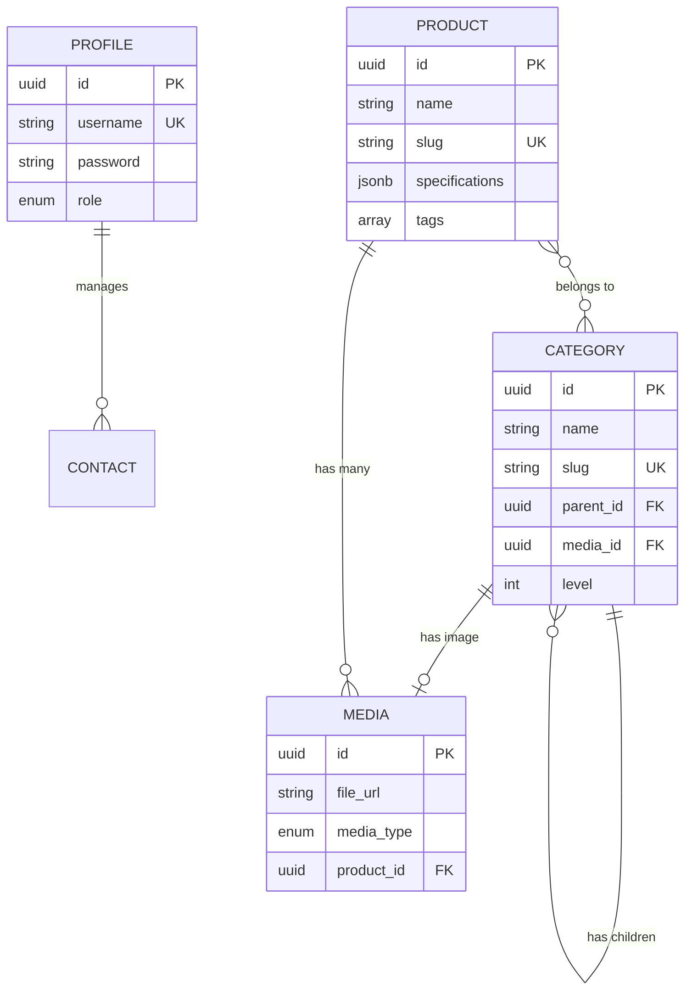

# 🗄️ Database Documentation

**PostgreSQL Database Schema** for Điện Tử Nam Tông E-Commerce Backend

---

## 📊 Overview

```
Tables: 7
Indexes: 12+
Relations: Many-to-Many, One-to-Many, Tree Structure
Pattern: Clean Schema with UUID, Timestamps, Soft Deletes
```

---

## 🗂️ Tables

### 1. `profile` - User Accounts

```sql
CREATE TABLE profile (
  id UUID PRIMARY KEY DEFAULT uuid_generate_v4(),
  username VARCHAR(100) UNIQUE NOT NULL,
  password VARCHAR(255) NOT NULL,        -- bcrypt hashed
  role profile_role_enum NOT NULL DEFAULT 'admin',
  company_name VARCHAR(255),
  phone VARCHAR(50),
  address TEXT,
  email VARCHAR(255),
  logo VARCHAR(500),
  is_active BOOLEAN DEFAULT true,
  created_at TIMESTAMP DEFAULT now(),
  updated_at TIMESTAMP DEFAULT now()
);

CREATE TYPE profile_role_enum AS ENUM ('admin', 'manager', 'staff');
```

**Purpose:** User authentication và authorization

---

### 2. `category` - Nested Categories với Tree Structure

```sql
CREATE TABLE category (
  id UUID PRIMARY KEY DEFAULT uuid_generate_v4(),
  name VARCHAR(255) NOT NULL,
  slug VARCHAR(255) UNIQUE NOT NULL,     -- URL-friendly
  description TEXT,
  parent_id UUID,                        -- Self-reference for tree
  media_id UUID,                         -- Category image
  sort_order INTEGER DEFAULT 0,
  level INTEGER DEFAULT 0,               -- Tree level (0 = root)
  is_active BOOLEAN DEFAULT true,
  created_at TIMESTAMP DEFAULT now(),
  updated_at TIMESTAMP DEFAULT now(),
  
  FOREIGN KEY (parent_id) REFERENCES category(id),
  FOREIGN KEY (media_id) REFERENCES media(id) ON DELETE SET NULL
);

CREATE INDEX idx_category_parent ON category(parent_id);
CREATE INDEX idx_category_active ON category(is_active) WHERE is_active = true;
```

**Tree Pattern:** Closure Table (auto-managed by TypeORM)

**Example:**
```
Điện tử (level=0)
├── Laptop (level=1)
│   ├── Gaming (level=2)
│   └── Office (level=2)
└── Điện thoại (level=1)
    ├── iPhone (level=2)
    └── Samsung (level=2)
```

---

### 3. `category_closure` - Tree Helper Table

```sql
CREATE TABLE category_closure (
  id_ancestor UUID NOT NULL,
  id_descendant UUID NOT NULL,
  PRIMARY KEY (id_ancestor, id_descendant),
  
  FOREIGN KEY (id_ancestor) REFERENCES category(id) ON DELETE CASCADE,
  FOREIGN KEY (id_descendant) REFERENCES category(id) ON DELETE CASCADE
);

CREATE INDEX idx_closure_ancestor ON category_closure(id_ancestor);
CREATE INDEX idx_closure_descendant ON category_closure(id_descendant);
```

**Purpose:** Lưu TẤT CẢ quan hệ tổ tiên-con cháu

**Example Data:**
```
| id_ancestor      | id_descendant    | Meaning                    |
|------------------|------------------|----------------------------|
| dien-tu          | dien-tu          | Điện tử → Điện tử (self)  |
| dien-tu          | laptop           | Điện tử → Laptop          |
| dien-tu          | gaming           | Điện tử → Gaming          |
| laptop           | laptop           | Laptop → Laptop (self)    |
| laptop           | gaming           | Laptop → Gaming           |
| gaming           | gaming           | Gaming → Gaming (self)    |
```

**Benefit:** Get all descendants/ancestors với 1 query thay vì recursive!

---

### 4. `product` - Products

```sql
CREATE TABLE product (
  id UUID PRIMARY KEY DEFAULT uuid_generate_v4(),
  name VARCHAR(255) NOT NULL,
  slug VARCHAR(255) UNIQUE NOT NULL,
  sku VARCHAR(100),                      -- Product code
  price NUMERIC(10,2),
  short_description TEXT,
  description TEXT,
  specifications JSONB,                  -- Flexible specs
  tags TEXT[],                           -- PostgreSQL array
  view_count INTEGER DEFAULT 0,
  is_active BOOLEAN DEFAULT true,
  in_stock BOOLEAN DEFAULT true,
  created_at TIMESTAMP DEFAULT now(),
  updated_at TIMESTAMP DEFAULT now()
);

-- Indexes for performance
CREATE INDEX idx_product_name ON product(name);
CREATE INDEX idx_product_price ON product(price);
CREATE INDEX idx_product_active ON product(is_active);
CREATE INDEX idx_product_created ON product(created_at);
```

**JSONB Example:**
```json
{
  "specifications": {
    "CPU": "Intel i7-12700H",
    "RAM": "16GB DDR5",
    "Storage": "512GB NVMe SSD",
    "Display": "15.6\" FHD 144Hz"
  }
}
```

---

### 5. `product_category` - Many-to-Many Junction

```sql
CREATE TABLE product_category (
  product_id UUID NOT NULL,
  category_id UUID NOT NULL,
  PRIMARY KEY (product_id, category_id),
  
  FOREIGN KEY (product_id) REFERENCES product(id) ON DELETE CASCADE,
  FOREIGN KEY (category_id) REFERENCES category(id)
);

CREATE INDEX idx_product_category_product ON product_category(product_id);
CREATE INDEX idx_product_category_category ON product_category(category_id);
```

**Purpose:** 1 product có thể thuộc nhiều categories

---

### 6. `media` - Multi-Media Storage

```sql
CREATE TABLE media (
  id UUID PRIMARY KEY DEFAULT uuid_generate_v4(),
  file_name VARCHAR(255) NOT NULL,
  file_url VARCHAR(500) NOT NULL,        -- Supabase Storage URL
  media_type media_type_enum DEFAULT 'image',
  mime_type VARCHAR(100),                -- image/jpeg, video/mp4, etc.
  file_size BIGINT,                      -- Bytes
  width INTEGER,                         -- For images
  height INTEGER,                        -- For images
  alt_text VARCHAR(255),                 -- SEO/Accessibility
  description TEXT,
  sort_order INTEGER DEFAULT 0,
  product_id UUID,                       -- Optional: belongs to product
  is_active BOOLEAN DEFAULT true,
  created_at TIMESTAMP DEFAULT now(),
  updated_at TIMESTAMP DEFAULT now(),
  
  FOREIGN KEY (product_id) REFERENCES product(id) ON DELETE CASCADE
);

CREATE TYPE media_type_enum AS ENUM ('image', 'video', 'audio', 'document', 'other');

CREATE INDEX idx_media_product ON media(product_id);
CREATE INDEX idx_media_type ON media(media_type);
```

**Purpose:** Unified media system cho products & categories

---

### 7. `contact` - Contact Form Submissions

```sql
CREATE TABLE contact (
  id UUID PRIMARY KEY DEFAULT uuid_generate_v4(),
  name VARCHAR(255) NOT NULL,
  phone VARCHAR(50) NOT NULL,
  address TEXT,
  message TEXT,
  status contact_status_enum DEFAULT 'new',
  created_at TIMESTAMP DEFAULT now(),
  updated_at TIMESTAMP DEFAULT now()
);

CREATE TYPE contact_status_enum AS ENUM ('new', 'processing', 'completed', 'cancelled');
```

---

## 🔗 Entity Relationships



---

## 🚀 Quick Setup

### 1. Create Database

```bash
# PostgreSQL
createdb dien_tu_nam_tong

# Or via psql
psql -U postgres
CREATE DATABASE dien_tu_nam_tong;
```

### 2. Configure Environment

```env
# .env
DB_HOST=localhost
DB_PORT=5432
DB_USER=postgres
DB_PASSWORD=your_password
DB_NAME=dien_tu_nam_tong
DB_SSL=false
```

### 3. Run Migrations

TypeORM auto-sync trong development mode:

```bash
npm run dev
# TypeORM sẽ tự động tạo/update tables
```

### 4. Seed Admin User

```bash
npm run seed:admin
```

---

## 📝 Common Queries

### Get Category Tree

```sql
-- Get all descendants of a category
SELECT c.*
FROM category c
JOIN category_closure cc ON c.id = cc.id_descendant
WHERE cc.id_ancestor = 'category-uuid';

-- Get breadcrumb path
SELECT c.*
FROM category c
JOIN category_closure cc ON c.id = cc.id_ancestor
WHERE cc.id_descendant = 'category-uuid'
ORDER BY c.level ASC;
```

### Get Products with Filters

```sql
-- Products trong category + subcategories
SELECT DISTINCT p.*
FROM product p
JOIN product_category pc ON p.id = pc.product_id
JOIN category_closure cc ON pc.category_id = cc.id_descendant
WHERE cc.id_ancestor = 'parent-category-uuid'
  AND p.is_active = true
  AND p.in_stock = true
  AND p.price BETWEEN 1000 AND 50000
ORDER BY p.created_at DESC
LIMIT 20;
```

### Search Products

```sql
-- Full-text search with indexes
SELECT p.*
FROM product p
WHERE p.is_active = true
  AND (
    LOWER(p.name) LIKE LOWER('%laptop%')
    OR LOWER(p.description) LIKE LOWER('%laptop%')
    OR LOWER(p.sku) LIKE LOWER('%laptop%')
  )
ORDER BY p.view_count DESC;
```

---

## 🎯 Indexes Strategy

### High-Performance Queries

```sql
-- Category lookups
CREATE INDEX idx_category_slug ON category(slug);
CREATE INDEX idx_category_parent ON category(parent_id);

-- Product search/filter
CREATE INDEX idx_product_name ON product(name);
CREATE INDEX idx_product_price ON product(price);
CREATE INDEX idx_product_active ON product(is_active);

-- Partial index (smaller, faster)
CREATE INDEX idx_product_active_partial 
  ON product(is_active) 
  WHERE is_active = true;

-- Tree operations
CREATE INDEX idx_closure_ancestor ON category_closure(id_ancestor);
CREATE INDEX idx_closure_descendant ON category_closure(id_descendant);

-- Media lookups
CREATE INDEX idx_media_product ON media(product_id);
```

---

## 🔧 Maintenance

### Vacuum Database

```sql
-- Analyze và optimize
VACUUM ANALYZE;

-- Per table
VACUUM ANALYZE product;
VACUUM ANALYZE category;
```

### Check Index Usage

```sql
SELECT 
  schemaname,
  tablename,
  indexname,
  idx_scan,
  idx_tup_read,
  idx_tup_fetch
FROM pg_stat_user_indexes
WHERE schemaname = 'public'
ORDER BY idx_scan DESC;
```

### Database Size

```sql
SELECT 
  pg_size_pretty(pg_database_size('dien_tu_nam_tong')) as db_size;

SELECT 
  tablename,
  pg_size_pretty(pg_total_relation_size(tablename::text)) as size
FROM pg_tables
WHERE schemaname = 'public'
ORDER BY pg_total_relation_size(tablename::text) DESC;
```

---

## 🛡️ Backup & Restore

### Backup

```bash
# Full database
pg_dump -U postgres dien_tu_nam_tong > backup.sql

# Schema only
pg_dump -U postgres --schema-only dien_tu_nam_tong > schema.sql

# Data only
pg_dump -U postgres --data-only dien_tu_nam_tong > data.sql
```

### Restore

```bash
psql -U postgres dien_tu_nam_tong < backup.sql
```

---

## 📊 Performance Tips

1. **Use Indexes** - Thêm indexes cho các columns hay query
2. **Partial Indexes** - Index chỉ records active
3. **EXPLAIN ANALYZE** - Analyze query performance
4. **Connection Pooling** - TypeORM built-in pool
5. **Eager/Lazy Loading** - Load relations khi cần
6. **Query Builder** - Tránh N+1 queries

---

## 🔗 References

- [TypeORM Documentation](https://typeorm.io/)
- [PostgreSQL Indexes](https://www.postgresql.org/docs/current/indexes.html)
- [Closure Table Pattern](https://www.slideshare.net/billkarwin/models-for-hierarchical-data)

---

**Database Version:** PostgreSQL 14+  
**ORM:** TypeORM 0.3.20  
**Last Updated:** February 2026

